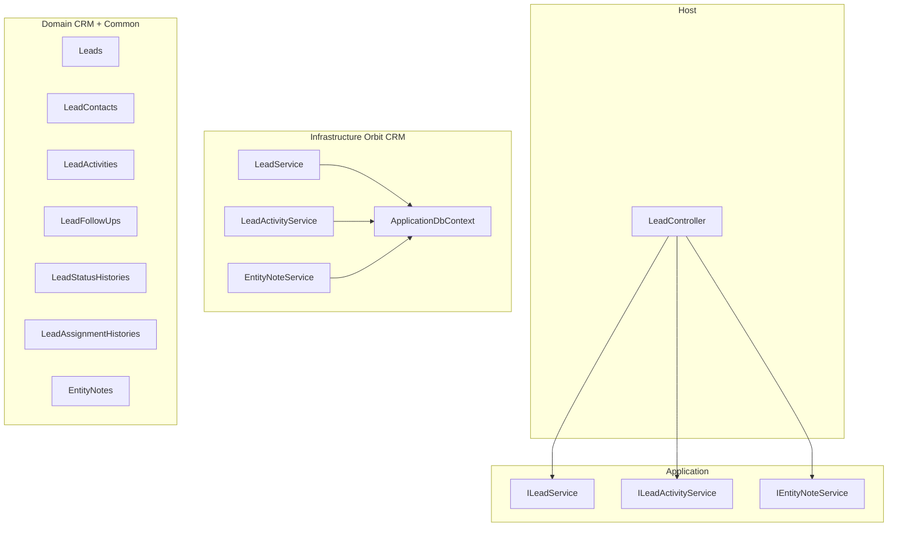

# CRM Lead Management — Module Plan

> **Status:** Approved for implementation (V1)  
> **Last updated:** 2026-07-09  
> **Reference module:** FormDesigner (backend), manage-forms + manage-tenants (frontend)

This document is the source of truth for implementing the first CRM module: **Lead Management**. Before writing any code, follow the mandatory checklist in [Implementation Guardrails](#implementation-guardrails).

---

## Implementation Guardrails

All CRM/Lead code **must** comply with project Cursor configuration:

### Rules (always enforced)

| Rule file | Applies to |
|-----------|------------|
| [`.cursor/rules/general-flowpilot.mdc`](../rules/general-flowpilot.mdc) | All `src/**/*.cs` — layer boundaries, plural naming, CancellationToken, no CQRS/repos |
| [`.cursor/rules/new-module-creation.mdc`](../rules/new-module-creation.mdc) | New CRM module checklist — entities, DTOs, services, controllers, permissions, migration |
| [`.cursor/rules/controller-thin-rule.mdc`](../rules/controller-thin-rule.mdc) | `Host/Controllers/CRM/**` — delegate only, MustHavePermission, OpenApiOperation |
| [`.cursor/rules/dto-naming.mdc`](../rules/dto-naming.mdc) | `Application/CRM/Model/**` — Create/Update/Search/View DTO naming |
| [`.cursor/rules/persistence-boundary-rule.mdc`](../rules/persistence-boundary-rule.mdc) | Application + Domain — no Infrastructure or DbContext references |

### Prompts (workflow templates)

| Prompt | When to use |
|--------|-------------|
| [`.cursor/prompts/NEW_MODULE_PROMPT.md`](../prompts/NEW_MODULE_PROMPT.md) | Full module creation — this Lead module |
| [`.cursor/prompts/ADD_ENTITY_PROMPT.md`](../prompts/ADD_ENTITY_PROMPT.md) | Adding entities to CRM later (e.g. Opportunities) |
| [`.cursor/prompts/ADD_ENDPOINT_PROMPT.md`](../prompts/ADD_ENDPOINT_PROMPT.md) | New endpoints on LeadController |
| [`.cursor/prompts/REFACTOR_SERVICE_PROMPT.md`](../prompts/REFACTOR_SERVICE_PROMPT.md) | LeadService refactors |

### Supporting docs

- [`.cursor/AGENTS.md`](../AGENTS.md) — golden rules, layer responsibilities, service pattern
- [`.cursor/docs/01_SYSTEM_ARCHITECTURE.md`](01_SYSTEM_ARCHITECTURE.md) — solution structure
- [`.cursor/docs/02_ARCHITECTURE_DECISIONS.md`](02_ARCHITECTURE_DECISIONS.md) — approved vs deferred patterns
- [`.cursor/docs/REFERENCE_MODULES.md`](REFERENCE_MODULES.md) — FormDesigner, LookUp, Appointment
- [`.cursor/docs/ANTI_PATTERNS.md`](ANTI_PATTERNS.md) — what not to do
- [`.cursor/docs/MODULE_OUTPUT_FORMAT.md`](MODULE_OUTPUT_FORMAT.md) — plan format (this doc fulfills that for CRM)

### Pre-implementation checklist

Before generating code, confirm:

1. Module name: **CRM / Lead Management**
2. DbContext: **ApplicationDbContext**
3. Entities: Leads, LeadContacts, LeadActivities, LeadFollowUps, LeadStatusHistories, LeadAssignmentHistories, EntityNotes
4. DTOs: per dto-naming rule
5. Permissions: `SystemResource.ManageLeads`
6. Controller: `VersionedApiController` → `api/v{version}/Lead`
7. Migration: `Add-Migration CRM_LeadManagement -Context ApplicationDbContext`
8. **No** MediatR, CQRS, repositories, or domain events unless explicitly requested
9. **CancellationToken** on all new async service methods
10. **TenantId only** — no StoreId/OrganizationId in V1
11. **No database migrations** — do not create or apply EF migrations; user runs manually
12. **No NSwag-generated file edits** — do not modify `FrontEnd/src/helpers/api/WebApiClient.ts` or `apiClients.ts`; user regenerates via NSwag. Use a separate manual API client until then.

---

## Overview

Implement Lead Management as the first CRM module:

- **Backend:** Domain, Application, Infrastructure, Host on `ApplicationDbContext` with versioned REST APIs
- **Frontend:** React pages under `FrontEnd/src/pages/orbit/manage-leads`, routes `/manage-leads`, menu Sales/CRM > Leads
- **Key decisions:** Global `EntityNotes` (not LeadNote); TenantId-only scoping; Won preserves history via `FKConvertedCustomerId`

---

## Spec Assessment

**What works well as-is**

- Full lead lifecycle fields (business, contact, address, sales, activities, follow-ups, history)
- Status pipeline with history (supports Won → future customer conversion without data loss)
- Activity timeline driving `LastActivityDate` / `NextFollowUpDate`
- Duplicate prevention on Mobile / Email / GST
- List filters: My Leads, Today, Overdue, Won/Lost/Archived

**Adjustments incorporated**

| Topic | Original spec | Decision |
|-------|---------------|----------|
| Entity file names | `Lead.cs` (singular) | **Plural:** `Leads.cs`, `LeadActivities.cs`, etc. |
| `LeadNote` | Domain entity listed | **Global `EntityNotes`** — reusable for Customer, Support, etc. |
| `StoreId` / `OrganizationId` | Mentioned | **Deferred for V1** — `TenantId` only via `AuditableEntity` |
| Frontend routes | `/orbit/manage-leads` | **`/manage-leads`** — matches existing `MenuLinks` style |
| API style | REST | **`VersionedApiController`** — `api/v{version}/Lead` |
| Permissions | Not specified | **`SystemResource.ManageLeads`** |
| "Interested" filter | Listed | **`InterestLevel`** enum filter, not LeadStatus |
| "Archived" filter | Listed | **`IsArchived`** on Leads (separate from `IsDeleted`) |
| Future conversion | Won preserves history | **`ConvertedOn`**, **`FKConvertedCustomerId`** on Leads |
| Activity Note vs Notes tab | Both | **`LeadActivityType.Note`** = timed activity; **`EntityNotes`** = Notes tab |
| Attachments | Placeholder | Nullable `AttachmentUrl` on activity; no upload in V1 |

---

## Architecture Overview



Use **partial `LeadController`** (FormDesigner pattern) — single controller, not separate LeadActivityController unless swagger grouping is needed.

---

## Backend Design

### DbContext & tenancy

- Register all CRM entities on `ApplicationDbContext` (tenant-scoped, same as FormDesigner/Appointment)
- **`TenantId` only** for V1 — auto-set via `BaseDbContext` global query filter
- **No `StoreId` / `OrganizationId` in V1** — add via follow-up migration when store/org modules exist

### Domain entities

**`Leads`** — root aggregate (`src/Core/Domain/CRM/Leads.cs`)

- Business: `BusinessName`, `BusinessType`, `CurrentPOS`, `Website`, `GstNumber`, `Pan`, `NumberOfOutlets`, `ExpectedMonthlyBilling`, `ExpectedRevenue`, `CompanySize`
- Sales: `LeadSource`, `FKAssignedToUserId` (string), `Priority`, `LeadStatus`, `ExpectedClosingDate`, `InterestLevel`
- Address: `Country`, `State`, `City`, `Area`, `Pincode`, `FullAddress`, `GoogleMapsLink`
- Denormalized: `LastActivityDate`, `NextFollowUpDate`
- Lifecycle: `IsArchived`, `ConvertedOn`, `FKConvertedCustomerId`
- Additional (on lead or via EntityNotes): `PainPoints`, `Competitors`, `Requirements` — store on `Leads` as text fields for V1

**`LeadContacts`** — primary contact 1:1 V1 (`IsPrimary = true`)

- `FKLeadPKId`, `OwnerName`, `Designation`, `Mobile`, `WhatsApp`, `Email`, `AlternatePhone`

**`LeadActivities`**

- `FKLeadPKId`, `ActivityType`, `ActivityDate`, `ActivityTime`, `DurationMinutes`, `Outcome`, `Notes`, `NextFollowUpDate`, attachment placeholders

**`LeadFollowUps`**

- `FKLeadPKId`, `NextFollowUpDate`, `FollowUpType`, `FollowUpStatus` (Pending/Completed/Missed/Cancelled), `ReminderNote`

**`LeadStatusHistories`** — append-only

- `FKLeadPKId`, `FromStatus`, `ToStatus`, `ChangedByUserId`, `ChangedOn`, `Remarks`

**`LeadAssignmentHistories`** — append-only

- `FKLeadPKId`, `FromUserId`, `ToUserId`, `AssignedByUserId`, `AssignedOn`, `Remarks`

**`EntityNotes`** — global (`src/Core/Domain/Common/EntityNotes.cs`)

- `EntityNoteType` enum: `Lead`, `LeadSummary`, `Customer`, `Support` (V1: `Lead` + `LeadSummary`)
- `FKEntityPKId` (int), `NoteText`
- `TenantId` via `AuditableEntity`

**Enums** (`Domain/Enums/CRM/`)

- `LeadStatus`: New, Contacted, Qualified, DemoScheduled, DemoCompleted, ProposalSent, Negotiation, Won, Lost, OnHold
- `LeadActivityType`: Call, Meeting, Demo, Visit, WhatsApp, Email, Proposal, Note, Task
- `FollowUpStatus`, `FollowUpType`, `Priority`, `InterestLevel`

### Application layer

**`ILeadService`** — `ITransientService`

- `SearchAsync(SearchLeadRequest)` → `PaginationResponse<ViewLeadListResponse>`
- `GetByIdAsync`, `CreateAsync`, `UpdateAsync`
- `UpdateStatusAsync`, `AssignAsync`
- `GetTodayFollowUpsAsync`, `GetOverdueFollowUpsAsync`

**`ILeadActivityService`**

- `GetByLeadIdAsync`, `CreateAsync` (updates `LastActivityDate` + optional `NextFollowUpDate`)

**`IEntityNoteService`**

- `GetByEntityAsync(EntityNoteType, entityId)`, `CreateAsync`, `UpdateAsync`, `DeleteAsync`

**DTOs**

- `SearchLeadRequest` extends `SearchRequestBaseClass` + `LeadFilterType`, `SearchText`, `AssignedToUserId`, date range
- `CreateLeadRequest` / `UpdateLeadRequest` — nested sections (Business, Contact, Address, Sales, Additional)
- `ViewLeadDetailResponse`, `ViewLeadListResponse`
- `CreateLeadActivityRequest`, `ViewLeadActivityResponse`
- `CreateEntityNoteRequest`, `ViewEntityNoteResponse`

**Validation**

- Required: BusinessName, BusinessType, OwnerName, Mobile, LeadSource, AssignedSalesPerson
- Duplicate check: `ConflictException` if Mobile, Email, or GST matches existing lead in tenant

### Infrastructure

**`LeadService`** (`src/Infrastructure/Orbit/CRM/LeadService.cs`)

- Transactional create: Leads + LeadContacts + initial LeadStatusHistory + optional EntityNote (LeadSummary)
- Search via `PaginatedListAsync`
- Status/assign append history rows
- My Leads: `FKAssignedToUserId == currentUserId`
- Today/Overdue: `NextFollowUpDate` vs UTC today

**`LeadActivityService`**

- On create: update `LastActivityDate`; optional `NextFollowUpDate`; optionally create LeadFollowUp

### API endpoints

Base: `VersionedApiController` → `api/v{version}/Lead`

| Method | Route | Action |
|--------|-------|--------|
| GET | `/` | Search leads |
| GET | `/{id}` | Lead detail |
| POST | `/` | Create lead |
| PUT | `/{id}` | Update lead |
| POST | `/{id}/status` | Status change + history |
| POST | `/{id}/assign` | Assign + history |
| GET | `/{id}/activities` | Activity timeline |
| POST | `/{id}/activities` | Add activity |
| GET | `/followups/today` | Today's follow-ups |
| GET | `/followups/overdue` | Overdue follow-ups |
| GET | `/{id}/notes` | Entity notes for lead |
| POST | `/{id}/notes` | Add note |

Permissions: `[MustHavePermission(SystemAction.*, SystemResource.ManageLeads)]`

### Migration

```powershell
# Run manually — agent does NOT create or apply migrations
Add-Migration CRM_LeadManagement -Context ApplicationDbContext
Update-Database -Context ApplicationDbContext
```

Consider tenant-scoped duplicate checks for Mobile, Email, GstNumber.

---

## Frontend Design

### File structure

```
FrontEnd/src/pages/orbit/manage-leads/
  index.tsx
  Components/
    ViewLeads.tsx
    ViewLeadsActionButtons.tsx
    AddLeadDetails.tsx
    EditLeadLandingPage.tsx
    EditLeadOverview.tsx
    ViewLeadActivities.tsx
    ViewLeadFollowUps.tsx
    ViewLeadNotes.tsx
    ViewLeadHistory.tsx
```

### Navigation

- Menu: **Sales / CRM** > **Leads** → `/manage-leads`
- Routes: `/manage-leads`, `/manage-leads/create`, `/manage-leads/:id`

### API integration

1. Backend swagger exposes Lead endpoints
2. **User runs NSwag** to regenerate `WebApiClient.ts` and `apiClients.ts` (do not edit these manually)
3. Until NSwag regen: use `FrontEnd/src/helpers/api/LeadApiClient.ts` (manual client with `authenticatedFetch`)
4. Add `LeadService.ts` + `ILeadRepository` (pattern: `FormDesignerService.ts`)
5. Permissions: `Permissions_ManageLeads_*` in `permissions.ts`

### UI behavior

- **List:** DataGridWithPagination, preset filters, search, assigned-user dropdown, date filter
- **Create:** VerticalForm, 5 card sections, required validation
- **Detail tabs:** Overview | Activities | Follow-ups | Notes | History

---

## Implementation Phases

| Phase | Scope |
|-------|-------|
| 1 — Backend foundation | Domain, enums, DbContext, migration, permissions, LeadService CRUD + search + duplicates |
| 2 — Backend workflows | Status/assign history, activities, follow-ups, EntityNotes, all endpoints |
| 3 — Frontend list + create | Menu, routes, LeadService, list + create form |
| 4 — Frontend detail | Tabbed detail, activities, notes, history |
| 5 — Polish | i18n, swagger, NSwag, manual test checklist |

---

## Open Points (defaults chosen)

1. **BusinessType / LeadSource / CurrentPOS:** V1 string fields; migrate to LookUp in V2
2. **LeadController:** Partial class (FormDesigner pattern)
3. **Route prefix:** `/manage-leads` (not `/orbit/manage-leads`)
4. **StoreId / OrganizationId:** Deferred; use `FKConvertedCustomerId` for post-Won linkage

---

## Implementation Todos

- [ ] Create CRM domain entities + EntityNotes + enums
- [ ] Add ILeadService, ILeadActivityService, IEntityNoteService + DTOs
- [ ] Implement services, DbSets, ManageLeads permissions
- [ ] Add LeadController, migration, workflows
- [ ] Frontend menu, routes, LeadService, NSwag
- [ ] List page + create form
- [ ] Tabbed detail page
